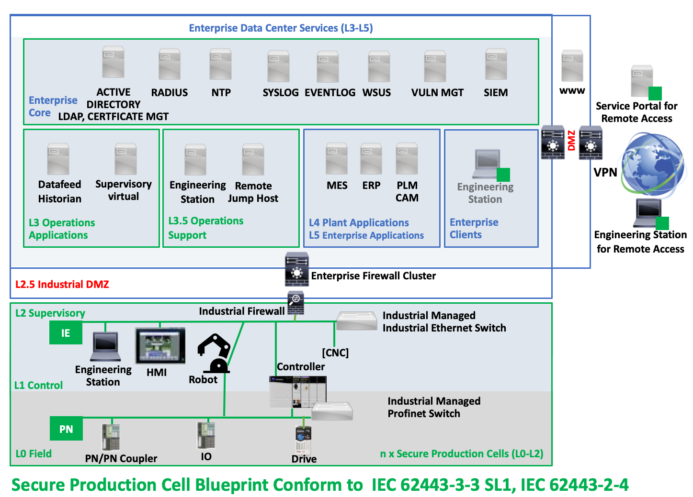

# Overview

Hello World

<!-- The system under consideration is a typical ***secure production cell*** build as managed industrial network cell with industrial automaton and control systems (IACS) fully integrated in a enterprise (IT/OT) architecture with a industrial firewall into an industrial dmz (L2.5). The ***secure production cell*** covers the layer L0, L1 and L2 of the ***Purdue Enterprise Reference Architecture*** referenced to IEC 62443-1-1. (Figure \ref{fig:blueprint})

\floatplacement{figure}{H}
 

In notation of IEC 62443-3-2 the production cell (L0, L1 and L2) and the operations layer (L3 and L3.5) are definied as zone. The connection - industrial dmz (L2.5) - between production cell (L0, L1 and L2) with the enterprise network layer (L3 and L3.5) are definied as conduit. 

The follow minimum system requirements from IEC 62443-3-3 SL1 are applicable to

- production cell (L0, L1 and L2)
- industrial dmz (L2.5) 
- operations management (L3 and L3.5)

and also for engineering station in the production cell, enterprise client network or for remote access via vpn and remote access service portals.

In enterprise network and especially for engineering stations additional given enterprise information security (eg ISO 27001 etc) and further IT policies are obligatory considerable.

The Integration of the secure production cell is a result of a secure system integration process, which is conform to the requirements to IEC 62443-2-4. The requirements of the security program for the service provider are a prerequisite for the assurance of overall security.

\paragraph{Secure Production Cell Integration} Industrial  Automation and Control System will be integrated via managed switches (for industrial ethernet and profinet) and industrial firewalls in secure production cells in conformance to IT/OT guidelines (network settings, network ranges, network names, approved devices etc )

\paragraph{Time Sync}
System should have a uniform system time and the possibility to synchronize this system time with an external time source.

\paragraph{Secure Communication Protocols} The communication between control device and enterprise application is secured by transport layer security protocols like
OPA UA/TLS, mqtts for secure communication between enterprise application and control device. For secure file transmission smbv3, secure webdav and ftps could be used. For secure remote access RDP and ssh with TLS support could be to utilized. Not listed protocolls eg. Rest API etc need a clearance and can be integrated with secure gateways or bridges.

\paragraph{Support of Essential Functions} An essential function is a function or capability that is required to maintain health, safety, the environment and availability for the equipment under control. Security measures shall not adversely affect essential functions of a high availability IACS unless supported by a risk assessment.

\paragraph{Least Privilege}
The capability to enforce the concept of least privilege shall be provided, with granularity of permissions and flexibility of mapping those permissions to roles sufficient to support it. Individual accountability should be available when required.

\paragraph{Restricted Internet Access via Proxy}
%Der Zugang zum Internet aus dem Umdasch Enterprise Network (UEN) ist auf die Protokolle HTTP, HTTPS und FTP eingeschränkt und erfolgt ausnahmslos über Proxy-Server. Die Zuordnung des Proxy-Servers erfolgt zentral mit Hilfe einer Konfigurationsdatei gemäß PAC-Standard (Proxyscript). Programme, welche für Ihre Funktion einen Internetzugang benötigen, müssen in der Lage sein, diese Datei korrekt zu verarbeiten und alle notwendigen Funktionen über einen Proxy abzuwickeln.

\paragraph{Patchabilityy - Support For Updates}
- firmware, upgrade or update are available in the whole asset lifecylce
- no outdated legacy software, operation systems

\paragraph{Remote Access via VPN}
Client 2 Side VPN for named external user
%- Client-to-Site Anbindung mit Checkpoint Endpoint Connect-->

