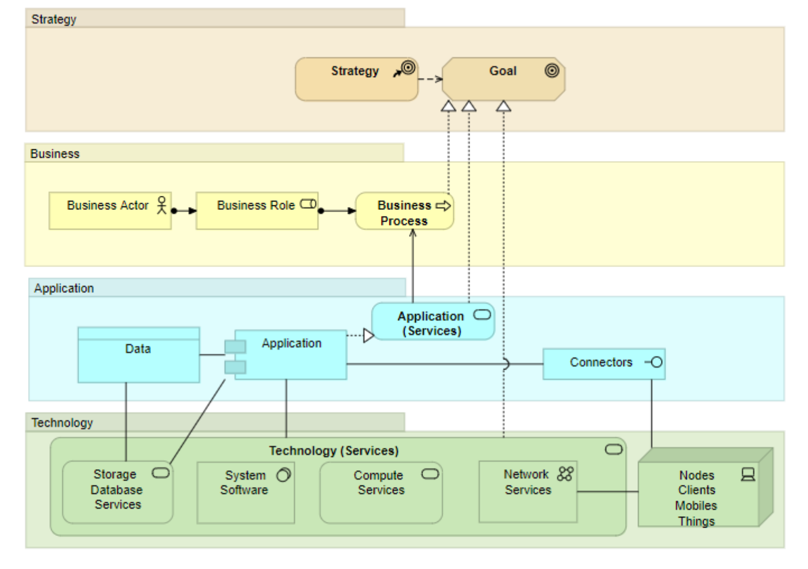
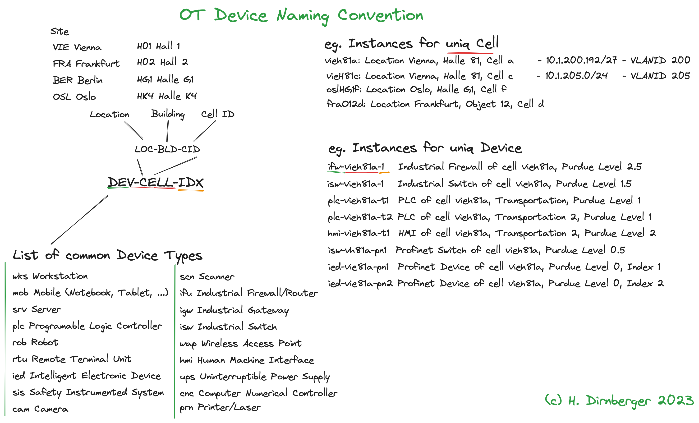
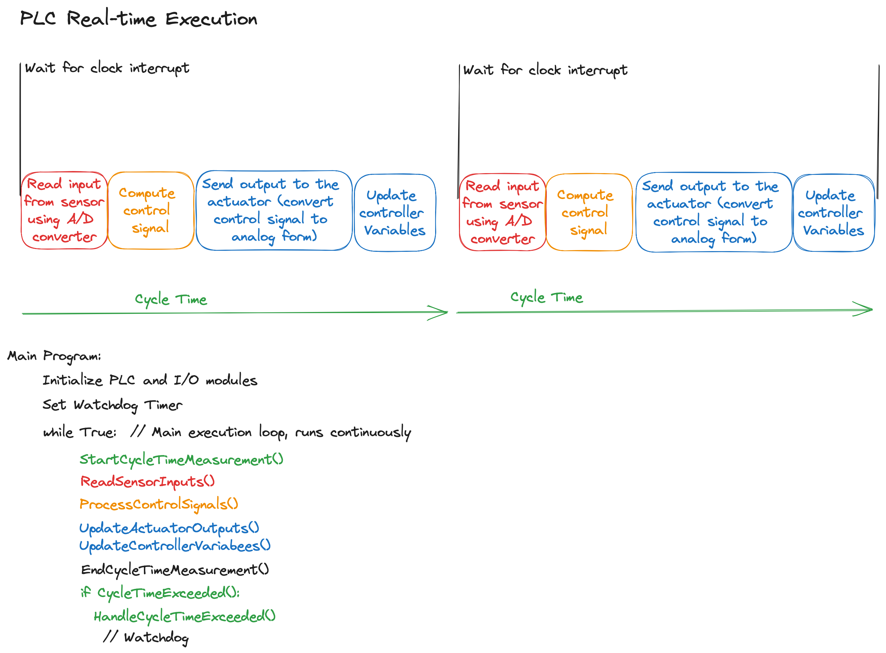

# Enterprise IoT

## Digital Production

### Technical Progress

### Digital Terms

### Digial Challenges

### Business Aliggnment

*Technology Alignment: Overcoming Challenges in IT/OT Convergence for Industrial Internet of Things (IIoT)*

Michael Ghezzo's story from the Raumschiff Enterprise illustrates the technological disparity between the bridge and the engine room, causing critical failures during crucial moments. Today, the convergence of Information Technology (IT) and Operational Technology (OT) for the Industrial Internet of Things (IIoT) presents significant opportunities for digitalization, but also brings forth complex technical and organizational challenges.

**Definition of IT Business Alignment**

IT Business Alignment is the process of harmonizing IT strategies and initiatives with the business objectives of an organization. It ensures that IT investments and efforts are directly contributing to the organization's success and value creation. The equation IT x OT = IOT$^2$ $\rightarrow$ IIoT represents the current trend towards the IIoT, where IT and OT are integrated to leverage digitalization.

**IT as a Value Contributor**

IT should never be pursued as a standalone goal; instead, it must be seen as a value contributor to the organization's success. IT governance is a combination of IT Business Alignment and IT Compliance, ensuring that IT services and initiatives align with business objectives and comply with regulatory requirements.

\floatplacement{figure}{H}
 

**Changes and Challenges from IT/OT Convergence**

The convergence of IT and OT brings significant changes to the digital landscape, but it also introduces challenges due to increasing complexity. Poorly secured IoT components and unclear supply chains in cloud infrastructures become potential entry points for cyberattacks. The introduction of malware, connectivity issues, and system crashes can disrupt operations, leading to production downtime, organizational inefficiencies, and reputational damage.

**Positive Development Recommendations**

To capitalize on the opportunities presented by IT/OT convergence and promote positive development, organizations need to understand both IT and OT realms. The concept of providing IT services involves transforming a technology-focused IT department into a strategic service organization. This alignment can be achieved through:

- Understanding Business Objectives: Align IT strategies and initiatives with the organization's overall business objectives and goals.
- Supporting Business Processes: Ensure that IT services support and enhance the organization's key business processes.
- Enhancing IT Service Management: Develop efficient IT service processes, applications, and infrastructure to deliver seamless support to business operations.
- Prioritizing Security: Implement robust security measures to safeguard against cyber threats and vulnerabilities, especially with the increasing interconnection between IT and OT systems.

**Conclusion**

Today, successful technology alignment requires a holistic approach to bridge the gap between IT and OT. Embracing the opportunities of IT/OT convergence while addressing the challenges through strategic planning and comprehensive security measures will empower organizations to thrive in the era of IIoT.

**References**

https://confare.at/sicherere-it-ot-konvergenz-herbert-dirnberger/

https://www.cio.de/a/was-ist-it-business-alignment,3667987

https://www.gabler-banklexikon.de/definition/it-alignment-70785

https://www.uni-bamberg.de/isdl/transfer/it-business-alignment/

https://blogs.cisco.com/government/necessity-it-ot-alignment

https://www.mckinsey.com/capabilities/operations/our-insights/converge-it-and-ot-to-turbocharge-business-operations-scaling-power

https://www.valion.ch/2019/09/20/transformation-priorisierung/

### Digital Strategies

## Industrial Internet of Things

### Basics

### Industrial Control Systems

#### Device Naming Convention

When building an Asset Inventory for Operational Technology (OT) or Industrial Control Systems, the topic of Device Naming Convention becomes crucial. It aims to address two main objectives: a) uniquely identify devices, and b) reduce the possibility of device naming conflicts. Additionally, it is essential to adhere to the 15-character limit imposed by Microsoft Active Directory.

Considering that cost centers or department names often change, maintaining a long-lasting device name is not conducive. Any change in the device name requires significant documentation efforts. Therefore, it is recommended to formalize the Device Naming Convention by the industrial end-customer and implement it by the System Integrator according to the client's requirements.

Ensuring unique device naming is of utmost importance as it is not always guaranteed or kept up-to-date in practice. Registering all devices on the Domain Name System (DNS) and using it as the single Point of Truth for name resolution with IP addresses is common in OT. It is essential to focus on systems in Purdue Level 1 since they communicate with the enterprise landscape through routers.

The Device Naming Convention and the unique name of the devices play a critical role in establishing a Configuration Management Database (CMDB) or Asset Inventories. Additionally, when utilizing OT Security Sensors like the OT Security Sensor Guardian by Nozomi Networks, unique and standardized naming conventions become even more crucial.

**Location-Based Device Naming Convention:**

\floatplacement{figure}{H}
 

One effective approach is to follow the concept of location-based identifiers used in electrical engineering. It is suitable for fixed cabled devices in Purdue Levels 0, 1, and 2. For Purdue Levels 3, 3.5, 4, and 5, and mobile devices, an adapted version can be used.

All names, including device, location, and cell names, should be written in lowercase.

The Cell name is constructed using the following key components:
Cell = LOC + BDG + CID

A unique name key is then formed as:
DEV-CELL-IDX

Where:

- DEV represents the Device Type (max 3 characters)
- LOC is the Location/Site Code (max 3 characters)
- BDG is the Building Code (max 3 characters)
- CID is the Cell index (max 3 characters)
- IDX is the Device Index

For instance:

- ifw-vieh81a: Industrial Firewall in the cell "vieh81a," Purdue Level 2.5
- isw-vieh81a-1: Industrial Switch in the cell "vieh81a," Purdue Level 1.5
- plc-vieh81a-t1: PLC in the cell "vieh81a," Transportation, Purdue Level 1

**Lists of Device Types and Locations/Sites**

Device Types:

- wks Workstation
- mob Mobile (Notebook, Tablet, ...)
- srv Server
- plc Programmable Logic Controller
- rob Robot
- rtu Remote Terminal Unit
- ied Intelligent Electronic Device
- sis Safety Instrumented System
- cam Camera
- prn Printer/Laser
- scn Scanner
- iro Industrial Router
- igw Industrial Gateway
- isw Industrial Switch
- wap Wireless Access Point
- hmi Human Machine Interface
- ups Uninterruptible Power Supply
- cnc Computer Numerical Controller

Locations/Sites:

- VIE Vienna
- FRA Frankfurt
- BER Berlin
- OSL Oslo

Building Abbreviations:

- h01 Hall 1
- h02 Hall 2
- hg1 Hall G1
- hk4 Hall K4

Example Cell Names:

- vieh81a: Location Vienna, Hall 81, cell a
- vieh81c: Location Vienna, Hall 81, cell c
- oslhg1f: Location Oslo, Hall G1, cell f
- frao12d: Location Frankfurt, Object 12, Cell d

**Application of the Naming Convention**

The device name can be constructed by combining the Device Type, Cell name, and Index. For example:
- mob-vieh02m-3: Mobile, Standort Vienna, Home Halle 2, Maintenance - Index 3

For devices running in data centers, the naming schema can be adapted, such as:

- srv-viedc1g-his: Server Historian, Standort Vienna, Datacenter, Cell g
- srv-viedc1f-log: Server Logging, Standort Vienna, Datacenter, Cell f

The naming convention allows for easy organization and identification of devices and their specific locations, facilitating device management and asset tracking in industrial environments.

**Additional Sources**

[LinkedIn - Gemeinsam für sichere Produktionsumgebungen](https://www.linkedin.com/pulse/gemeinsam-für-sichere-produktionsumgebungen-herbert-dirnberger/)

[LinkedIn - Ralph Langner UML Search Results](https://www.linkedin.com/search/results/content/?keywords=Ralph%20Langner%20UML&sid=V2C&update=urn%3Ali%3Afs_updateV2%3A(urn%3Ali%3Aactivity%3A7093885940024107008%2CBLENDED_SEARCH_FEED%2CEMPTY%2CDEFAULT%2Cfalse))
  
[IEC 62443 Security Level 1 PDF](https://github.com/dirnberg/purdue_next/blob/main/IEC_62443_Security_Level_1.pdf)
  
[OT Security Sensor Guardian by Nozomi Networks](https://www.ikarussecurity.com/industrial-cyber-security/ot-security-sensor-guardian-by-nozomi-networks/)

### PLC

\newpage
#### Real-time Execution

In today's industrial automation systems, a programmable logic controller (PLC) functions as a real-time embedded computer with extensive input/output capabilities. The PLC executes programs in a cyclical manner, following a set of tasks with specified cycle times to ensure timely and accurate control of processes. This document explores the concepts of real-time execution, cycle time, watchdog, and multitasking in industrial PLCs.

**Real-time Execution**

Real-time execution in PLCs involves the periodic operation of the controller. It follows a specific sequence of steps, including sampling sensor signals, converting them to digital form using analog-to-digital converters (A/D converters), computing control signals, converting them to analog form for actuators, and updating controller variables. The PLC operates by waiting for clock interrupts, and at each interval, it performs the designated tasks in a prescribed order to maintain control over the process.

\floatplacement{figure}{H}
 

**Cycle Time**

The cycle time of a PLC refers to the time required to complete one full execution cycle of the program. It encompasses all the steps involved in real-time execution, including reading inputs, computing control signals, sending outputs, and updating variables. The cycle time directly impacts the responsiveness and efficiency of the PLC in controlling industrial processes. It is essential to optimize the cycle time for efficient operation.

The cycle time of a PLC depends on the complexity of the control program and the hardware capabilities. A typical industrial PLC may have cycle times ranging from 1ms to 250 ms, depending on the specific application's demands. Achieving a cycle time of 250 $ \mu$s represents an extreme optimization requiring all relevant conditions to be met, including fast input/output response times and suitable hardware configurations.

**Watchdog**

The watchdog function is a critical safety feature in PLCs. It involves the monitoring of the execution of the control program. If the PLC fails to complete a cycle within a specified time (watchdog time), the watchdog function is triggered. It serves as a safety mechanism to detect and respond to potential malfunctions or program errors. The watchdog function can initiate pre-defined actions to bring the system to a safe state in case of failure.

**Multitasking**

In the context of PLCs, multitasking refers to the capability of running multiple tasks concurrently. The IEC 61131 execution engine of a PLC consists of resources where one or more tasks can run simultaneously. Each task operates with its specific program, enabling efficient handling of various control tasks without interference. Multitasking allows the PLC to manage multiple processes effectively, meeting diverse industrial requirements.

\hspace{2cm}

---

**References**

[1] \url{https://tinyurl.com/vexb9z6n} ---
TH Mittelessen, Grundwissen SPS-Technik

[2] \url{https://tinyurl.com/y6z4wt5t} --- Siemens Learning material on S7-1200 PLCs

[3] \url{https://tinyurl.com/mvzzxvay} --- Siemens S7-1500 Manual - cycle and reaction times 

\hspace{2cm}

\begin{nabox}[colback=white]{ToDo}
\begin{itemize}
 \renewcommand{\labelitemi}{$\Square$} 
 \item Sketch Execution time
\end{itemize}
\end{nabox}

#### Real-time Communication with Profinet IO

**Industrial Ethernet Standard for Real-time Communication**

Profinet IO is an Industrial Ethernet standard that provides real-time communication capabilities for automation applications. It is designed to meet the diverse requirements of different automation systems by offering different performance classes. Profinet IO enables the exchange of data between controllers and field devices, such as sensors and actuators, in a precise and time-sensitive manner. This article will explore Profinet's performance classes, network communication, special network requirements.

**Profinet Performance Classes** 

Profinet is available in four performance classes: CC-A, CC-B, CC-C, and CC-D.

\begin{greenbox}[colback=white]{CC-A}
\begin{itemize}
 \renewcommand{\labelitemi}{$\Square$} 
 \item Provides basic communication with cyclic real-time communication over IO and acyclic communication over UDP.
  \item Suitable for applications like building automation and commonly used in that domain.
  \item Utilizes prioritization of Ethernet data packets using IEEE 802.1p (CoS) to ensure precise control in PROFINET systems.
  \item Can be deployed with unmanaged switches but also supports managed switches.
  \item Restricted to WLAN usage.
  \item Non-isochronous TCP/IP, RT Real-Time Class 1
\end{itemize}
\end{greenbox}

\begin{greenbox}[colback=white]{CC-B}
\begin{itemize}
 \renewcommand{\labelitemi}{$\Square$} 
\item Extends the functionality of CC-A with network diagnostics, topology information, redundancy, and dynamic reconfiguration.  
\item Suitable for manufacturing and process automation applications.  
\item Requires managed switches provides network diagnostics through SNMP and offers QoS (Quality of Service) and LLDP (Link Layer Discovery Protocol) support. Supports bandwith limitation and 802.1q (CoS)  
\item Supports Media Redundancy Protocol (MRP) for network reliability.
\item Generic Station Description Markup Language - GSDML Support
\item Non-isochronous TCP/IP, RT Real-Time Class 1
\end{itemize}
\end{greenbox}

\begin{greenbox}[colback=white]{CC-C}
\begin{itemize}
 \renewcommand{\labelitemi}{$\Square$} 
\item Builds upon CC-B by adding isochronous real-time (IRT) communication for motion control applications.
\item Real-Time Data Exchange - cycle tis down to 31.25 $/mu s$
\item Requires managed switches, and its real-time communication is based on IRT (Isochronous Real Time)
\item  managed switches provides network diagnostics through SNMP and offers QoS (Quality of Service) and LLDP (Link Layer Discovery Protocol) support. Supports bandwith limitation and Supports bandwith limitation and 802.1q (CoS)
\item Generic Station Description Markup Language - GSDML Support
\item Precise synchronization using Profinet Time Communication Protocol (PTCP).
\item Non-isochronous + isochronous TCP/IP, RT, IRT Real-Time Class 1, 2, 3
\end{itemize}
\end{greenbox}

\begin{greenbox}[colback=white]{CC-D}
\begin{itemize}
 \renewcommand{\labelitemi}{$\Square$} 
\item Similar to CC-C in terms of functionality but implements Time-Sensitive Networking (TSN) standards for advanced real-time applications.
\item Requires managed switches and supports bandwifths from 10 Mbit to 10 Gbit, including Wireless-Kommunikation (5G).
\end{itemize}
\end{greenbox}

\hspace{2cm}

**Network Communication and Network Packets**

Profinet IO utilizes Ethernet for communication, and its packets are Ethernet frames with Ethertype set to 0x8892. TCP/IP is implemented for process data exchange, and different communication channels are used for various tasks.

Services on **Ethertype 0x8892** in Profinet IO

**PTCP (Profinet Time Communication Protocol)** is responsible for precise time synchronization in a Profinet network. It ensures accurate clock synchronization among devices, crucial for time-critical applications like motion control and coordinated processes.

**Real-Time Acyclic Communication** in Profinet IO allows non-cyclic data exchange between devices and the controller. It is used for parameterization, configuration, and acyclic read/write operations, enabling the transfer of non-time-critical data.

**Real-Time Cyclic Communication (Class 1, 2, 3)** providing different levels of performance and determinism. These classes are used for standard cyclic data transfer and alarms, catering to various real-time requirements in automation applications.

**DCP (Discovery and Configuration Protocol)** facilitates the automatic detection and configuration of Profinet devices within the network. It allows the I/O controller to identify switches and set device names and IP addresses automatically, streamlining the configuration process.

These services, operating on Ethertype 0x8892, form the backbone of Profinet IO's communication capabilities, ensuring precise and efficient data exchange for various automation tasks.

Services on **Ethertype 0x88e3** in Profinet IO for PN MRP

**PN MRP (Profinet Media Redundancy Protocol)** is a redundancy mechanism that enhances the reliability and fault tolerance of Profinet IO networks. It ensures seamless communication even in the event of link failures by providing network redundancy. Devices in the network use PN MRP to detect and recover from link failures quickly, minimizing downtime and improving network robustness. It plays a vital role in mission-critical applications where network uptime is essential for continuous operation and safety.

**Typical Wireshark Display Filter for Profinet IO**: 

*eth.type == 0x8892 or
eth.type == 0x8893 or
lldp or
arp or
dcerpc or
snmp or
dhcp or
pnio or
pnrt*

\hspace{2cm}

**Special Network and Switch Requirements**

To ensure efficient and reliable communication in a Profinet IO network, **network segmentation is crucial**. Separating field-level traffic from control-level or enterprise IT traffic enhances security and simplifies network management. PROFINET IO also supports managed Switches with VLANs, firewalls and routers for enhanced network performance and security.

\hspace{2cm}

**PronetA**

PronetA from Siemens is a free tool that assists in configuring and testing Profinet networks. It automatically detects the network topology and displays connected Profinet devices, allowing for easy configuration, including IP address assignment and device naming. Moreover, ProfinetA's IO-Check feature enables the testing of network components for correct wiring and functionality before the entire system assembly.

**Conclusion** 

Profinet is a robust and flexible Industrial Ethernet standard that provides real-time communication for various automation applications. By understanding the different performance classes, network communication, and special requirements, engineers can design efficient and reliable Profinet networks to meet their automation needs.

\hspace{2cm}

**References**

[1] \url{https://tinyurl.com/2p8uuert} ---
Profinet Technologie

[2] \url{https://tinyurl.com/y6z4wt5t} ---
Siemens SCE Training S7-1200

[3] \url{https://tinyurl.com/5e97jwvw} ---
Intel TSN

[4] \url{https://tinyurl.com/mtj6627z} ---
PROFINET IO Conformance Classes

[5] \url{https://tinyurl.com/y6v8r5sb} ---
Neumann 2005 - Ethernet-based real-time communications with PROFINET IO

[6] \url{https://tinyurl.com/2p8tzxa5} ---
PROFINET device classes
